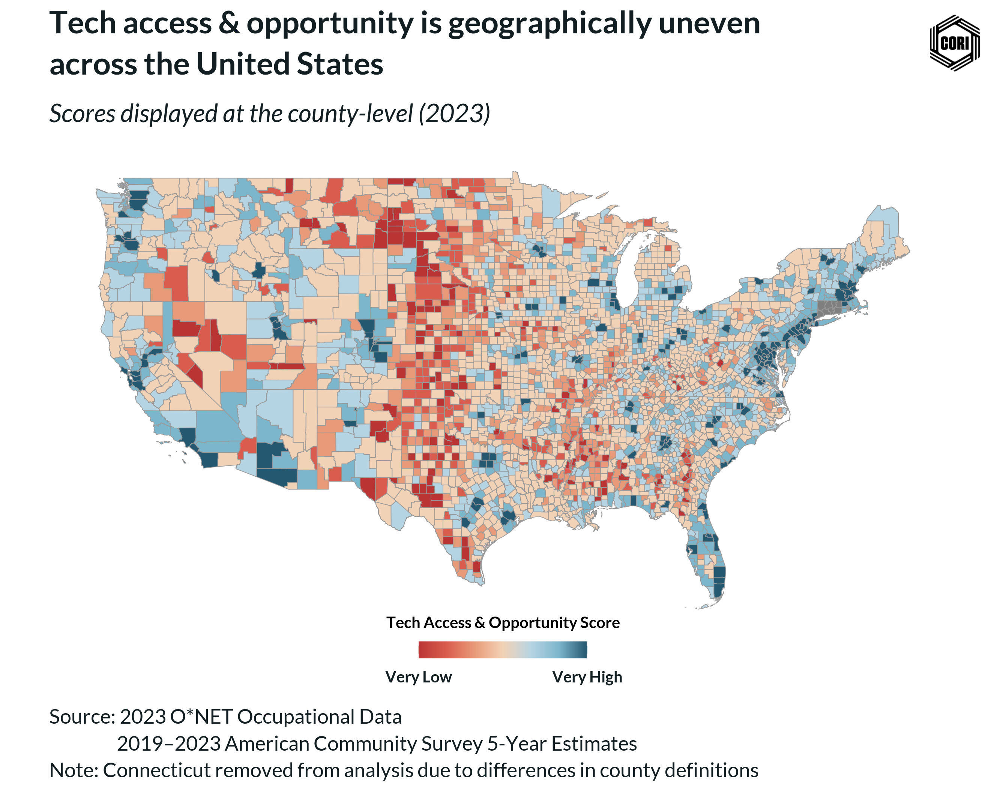
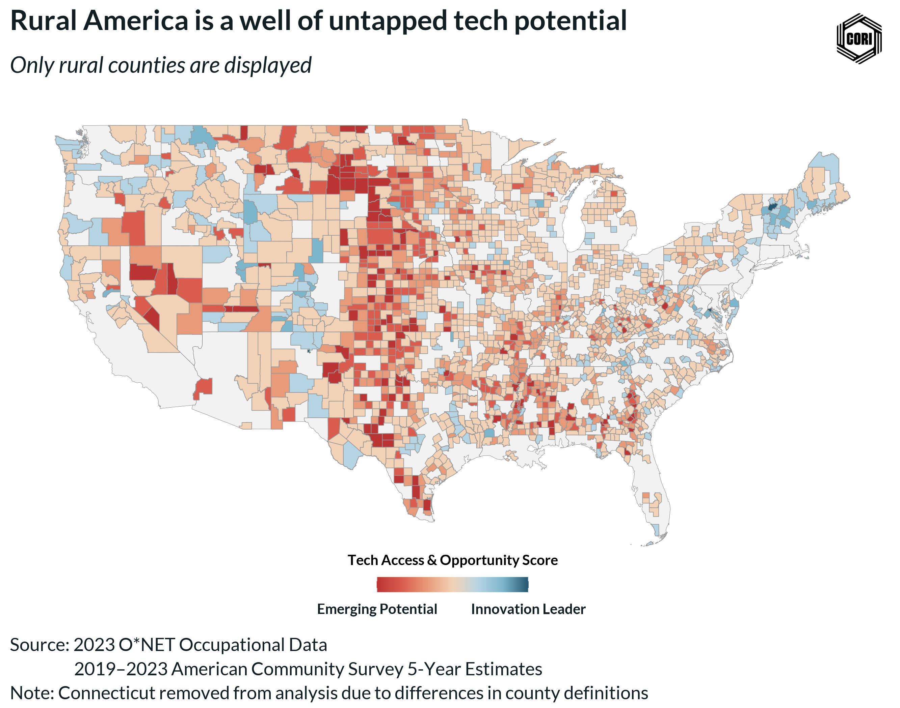
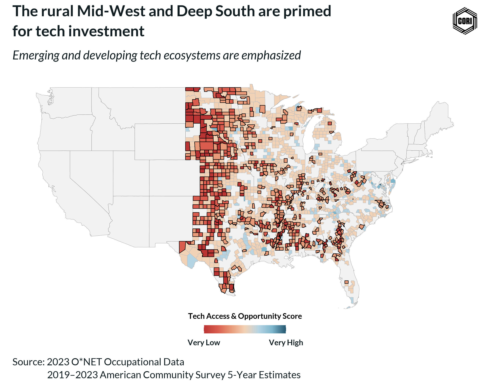

### **The promise of the digital economy remains out of reach for millions in rural America.**
While technology industries flourish in urban centers, a stark reality persists: vast regions of our country are becoming **tech deserts**, exacerbating economic disparities and perpetuating brain drain. The Center on Rural Innovation (CORI) is dedicated to confronting this critical challenge and fostering equitable access to high-tech opportunities. 

Despite the United States' rapid shift toward a tech-based economy, the distribution of high-tech jobs remains geographically uneven. Today, the vast majority of tech work opportunities is centrally positioned within large urban cities and their adjoining areas. Although official records indicate the rural workforce comprises 12-15% of the national prime age working body, tech jobs reflect less than 5% of available career pathways across all of rural America. Among the few tech jobs available in rural landscapes, they too remain geographically specific, where only a small proportion of rural counties retain a meaningful number of high-tech jobs. In contrast, a far more common occurrence among rural communities is a profound absence of good paying high-tech careers. This problem has far-reaching implications for rural communities, such as the continuation of 'brain drain'[^brain_drain] among a community's young people in search of better paying jobs within large metropolitans, the continued decline of economic stability and diversification of historically distressed small towns, and the persistent and incorrect evaluation that rural communities are flush with strong agricultural, mining, or manufacturing work--three industries that have exponentially declined in the past fifty years.


A problem of equal proportion to the lack of rural high-tech work is the sparsity of research dedicated toward highlighting this issue. Only recently have researchers begun to speak toward the substantive disparities between rural and metropolitan tech industries. Moreover, the measurement of tech-related work and industry makeup remains precarious due to its constantly evolving nature and wide breadth. These quagmires, compounded by a lack of interest among economists and social scientists to study rural problems, tends to the prevailing allusion that the difficulties for rural America to access tech jobs do not exist.

### **Tech deserts: CORI's findings into the state of tech access**
Recent research conducted by the Center on Rural Innovation (CORI) seeks to dispel the shroud that masks this problem by clearly highlighting the disconnect between rural America and access to tech jobs. To do this, researchers at CORI have developed a measure derived from several data sources that identifies a county's access to high-tech jobs and businesses across the United States. Referred to as the **Tech Access and Opportunity Score**, the scale measures several county-specific tech variables, such as the share of high-tech jobs[^tech_jobs], the number of high tech businesses, tech job postings on professional work platforms, and the share of general tradable services[^data_used]. The measure ranges from 1 (**Very Low**) to 7 (**Very High**) and reflects a county's high-tech industry topology for a given year. 


The measure is displayed below for all counties in the United States' Lower-48 contiguous body for the year 2023. The analysis reveals that much of rural America lags behind its metropolitan counterparts in tech access and opportunity. This fact is further highlighted in the second graphic, when nonrural counties are removed and only rural counties remain. Of the 176 **Very High** tech access and opportunity counties within the United States, only 3 are located in rural America (1.7%). Among the 349 counties with **High** tech access and opportunity, only 8.6% (30) are classified as rural.



### **Rural (in?)access to Tech**
The disparity in tech access between urban and rural counties becomes drastic when looking at the opposite end of the spectrum, where 92.8% of the counties categorized as having **Very Low** tech access and opportunity are classified as rural. By the numbers, that's 116 of 125 **Very Low** tech access and opportunity counties. In fact, more than 90% of counties categorized as **Very Low**, **Low**, and **Medium-Low** are classified as rural, and 77% of counties categorized as **Medium** are rural. In total, of the 1983 counties classified as rural by the Office of Management and Budget, 1693 (85.4%) do not reach above the **Medium** tech access and opportunity threshold. 



### **Tech deserts across the Great Plains and the Deep South**
When disaggregated by region, the emergence of a **tech desert** appears in the central Mid-West and Deep South. In these regions, the vast majority of counties do not surpass **Medium-Low** tech access and opportunity categories. From the tip of North Dakota to the southern basin of Texas, the absence of tech access is obvious. This trend continues into the entire South region, across the rural Black Belt South, stretching across Texas, Mississippi, Louisiana, Alabama, and into Georgia. Especially true for the South, the existence of a **tech desert** not only demonstrates a lack of access to high-tech jobs among rural communities, but further highlights historical and contemporary racial disparities that remain faceted within economic outcomes. Nearly 80% of America's black population resides in the South and the analysis displays that access to good-paying tech jobs for black community members in the region is virtually unavailable. 



The analysis also reveals a strong relationship between the lack of tech opportunities and other important economic indicators. For instance, in counties with **Very Low** or **Low** tech access and opportunity scores, median household income lags behind the rest of the nation by more than $20,000. Because of this, the share of the population that resides below the federally designated poverty threshold within these counties is much higher than state and national averages, and net migration is often negative, indicating that more residents are leaving than entering into these economically distressed areas. In short, a vicious trend appears to have taken hold among counties with poor tech access: lack of contemporary tech-based opportunities increases the likelihood of poverty and residents have little choice but to seek out better paying jobs elsewhere. In time, this downward trend could lead to loss of critical jobs within already distressed counties, a problem which in turn will likely lead to significant population decline. This potential problem spells disaster for the counties, states, and regions most impacted by the absence of tech jobs. 

### **Startling insights and a troublesome conclusion**
The geographic imbalance in tech access and opportunity is not merely a byproduct of industry clustering--it is a reflection of deeper systemic inequities that leave rural communities, particularly in the Midwest and South, on the digital and economic margins. While urban centers flourish with high-paying, innovation-driven careers, rural America remains sidelined as detailed by a tech desert that spans thousands of miles and impacts millions of lives. The novel measure we present here confirms what many rural residents already know firsthand: access to the digital economy is not equitably distributed. Addressing this disparity requires intentional investment, pragmatic policy, inclusive economic planning, and a shift in national perceptions that recognizes rural communities as critical to the country’s economic future. Without such efforts, the rural-urban tech divide will become more disparate, reinforcing cycles of disinvestment, economic decline, and structural inequality.


[^brain_drain]: Sowl, Smith, & Brown (2022) define 'brain drain' as the out-migration of young people away from their rural origins in search of better paying jobs in larger cities. 

[^tech_jobs]: CORI defines tech jobs as those with an O-NET Compatibility Score &ge;
 80.00 in relation to 15-XXXX computer and mathematics occupations and meet a minimum threshold score based on principal component analyses.

[^data_used]: Data utilized to create CORI's measure on tech access and opportunity is derived from data aggregated to the county level from the IRS's Form D, Lightcast's proprietary occupations database, and the American Community Survey 5-year estimates for years 2019 - 2023. The measure examines 7 tech-specific county-level indicators that are transformed into a single value which denotes the location's tech-related work that is concurrent or available. We perceive this value to define the county's available tech resources for its population to access for tech work and tech innovation. 


``` {r Setup, echo = FALSE, message = FALSE, warning = FALSE}

library(tidyverse)
library(here)
library(cori.charts)
library(coriverse)
library(tigris)
library(sf)

load_fonts()

i_am("blog/posts/17_nsf_tech_skills/index.qmd")


```

``` {r Data, echo = FALSE, message = FALSE, warning = FALSE}

con <- connect_to_db("proj_nsf")
nsf_dta <- DBI::dbReadTable(con, "nsf") %>% 
  mutate(
    tech_hub_numeric = as.numeric(factor(tech_hub_co_ord7, ordered = TRUE,
                                         levels = c(
                                           "Very Low",
                                           "Low",
                                           "Mid-Low",
                                           "Mid",
                                           "Mid-High",
                                           "High",
                                           "Very High")))
  )
DBI::dbDisconnect(con)

options(tigris_use_cache = TRUE, 
        tigris_class = "sf")

# Load county shapefiles
counties <- counties(cb = TRUE, year = 2020) %>% 
  rename("geoid" = "GEOID")

# US MAP ----
dta <- nsf_dta %>%
  filter(
    year == 2023
  )

map_dta <- counties %>% 
  left_join(
    dta, 
    by = "geoid"
  ) %>%
  select(
    year,
    geoid,
    st_abbrv = STUSPS,
    name_co,
    co_tech_percentile,
    co_tech_skill,
    tech_hub_co_ord7,
    tech_hub_numeric,
    geometry
  ) %>% 
  filter(
    !substr(geoid, 1, 2) %in% c("02", "15"),
    !substr(geoid, 1, 2) > "56"
  ) %>% 
  mutate(
    year = ifelse(is.na(year), 2023, year),
    tech_hub_co_ord7 = factor(tech_hub_co_ord7,
                              levels = c(
                              "Very Low", 
                              "Low",
                              "Mid-Low",
                              "Mid",
                              "Mid-High",
                              "High",
                              "Very High")),
    tech_hub_co_ord7 = fct_recode(tech_hub_co_ord7,
      "Medium" = "Mid"
    ))

# Get the US map data for under layer
us_map <- sf::st_as_sf(maps::map("state", plot = FALSE, fill = TRUE))

# Rural map data ----
rural <- ruraldefinitions::cbsa_2023 %>% 
  select(
    geoid,
    is_rural
  )

rural_map_dta <- map_dta %>% 
  left_join(
    rural,
    by = "geoid"
  ) %>% 
  filter(
    is_rural == "Rural"
  )


# South map data ----

south_states <- c(
  "DE", "MD", "DC", "VA", "WV", "NC", "SC", "GA", "FL", 
  "KY", "TN", "MS", "AL",                              
  "OK", "TX", "AR", "LA"                                
)

south_rural_map_dta <- map_dta %>% 
  left_join(
    rural,
    by = "geoid"
  ) %>% 
  filter(
    is_rural == "Rural",
    st_abbrv %in% south_states
  )

# Mid west map data ---
mid_west <-  c("IL", "IN", "IA", "KS", "MI", "MN", "MO", "NE", "ND", "OH", "SD", "WI")

# Data ----
rural_mid_west_map_dta <- map_dta %>% 
  left_join(
    rural,
    by = "geoid"
  ) %>% 
  filter(
    is_rural == "Rural",
    st_abbrv %in% mid_west
  )


# South and Mid West States
select_states <-  c("IL", "IN", "IA", "KS", "MI", 
                    "MN", "MO", "NE", "ND", "OH", 
                    "SD", "WI", "DE", "MD", "DC", 
                    "VA", "WV", "NC", "SC", "GA", 
                    "FL", "KY", "TN", "MS", "AL",                              
                    "OK", "TX", "AR", "LA")

select_states_dta <- map_dta %>% 
  left_join(
    rural,
    by = "geoid"
  ) %>% 
  filter(
    is_rural == "Rural",
    st_abbrv %in% select_states
  )
# Map colors ----

numeric_colors <- c(
  "1" = "#BA3434",
  "2" = "#D95C4E",
  "3" = "#E89A79",
  "4" = "#F2D2B6",
  "5" = "#B5D4E3",
  "6" = "#7CB6CC",
  "7" = "#245871"
)

gradient_colors <- unname(numeric_colors[as.character(1:7)])

```

``` {r US Map, echo = FALSE, message = FALSE, warning = FALSE}

# Map ----

fig <- ggplot() +
  geom_sf(data = us_map, color = "black", fill = "grey95", linewidth = 0.05) +
  geom_sf(data = map_dta, aes(fill = tech_hub_numeric), 
          color = "grey60", 
          size = 0.05,
          show.legend = TRUE) +
  cori.charts::theme_cori_map() +
  theme(
    legend.position = "bottom",
    legend.title = element_text(size = 10, face = "bold", family = "Lato"),
    legend.text = element_text(size = 10, face = "bold", family = "Lato"),
    legend.key.height = unit(.15, "in"),
    legend.key.width = unit(.30, "in"),
    legend.margin = margin(t = -25),
    legend.box.margin = margin(t = -10),
    plot.margin = margin(t = 5, r = 5, b = 5, l = 5)
  ) +
  scale_fill_gradientn(
    name = "Tech Access & Opportunity Score",
    colours = gradient_colors,
    limits = c(1, 7),
    breaks = c(1, 7),
    labels = c("Very Low", "Very High"),
    guide = guide_colorbar(
      direction = "horizontal",
      title.position = "top",
      title.hjust = 0.5,
      label.position = "bottom"
    )) +
  labs(
    title = "Tech access & opportunity is geographically uneven\nacross the United States",
    subtitle = "Scores displayed at the county-level (2023)",
    caption = "Source: 2023 O*NET Occupational Data\n                  2019–2023 American Community Survey 5-Year Estimates\nNote: Connecticut removed from analysis due to differences in county definitions",
    y = NULL,
    x = NULL
  )


save_plot(
  fig = fig,
  export_path = "viz/co_tech_innovation_score_us_map_nsf.jpg",
  chart_height = 7,
  add_logo = TRUE,
  logo_position = "top right",
  logo_path = "https://rwjf-public.s3.amazonaws.com/Logo-Mark_CORI_Black.svg",
  logo_scale = 20,
  img_scale = 1,
  units = "in",
  background = "white"
)

```
<!--  -->

``` {r Rural map, echo = FALSE, message = FALSE, warning = FALSE}

fig <- ggplot() +
  geom_sf(data = us_map, color = "black", fill = "grey95", linewidth = 0.05) +
  geom_sf(data = rural_map_dta, aes(fill = tech_hub_numeric), 
          color = "grey60", 
          size = 0.05, 
          show.legend = TRUE) +
  cori.charts::theme_cori_map() +
  theme(
    legend.position = "bottom",
    legend.title = element_text(size = 10, face = "bold", family = "Lato"),
    legend.text = element_text(size = 10, face = "bold", family = "Lato"),
    legend.key.height = unit(.15, "in"),
    legend.key.width = unit(.30, "in"),
    legend.margin = margin(t = -25),
    legend.box.margin = margin(t = -10),
    plot.margin = margin(t = 5, r = 5, b = 5, l = 5)
  ) +
  scale_fill_gradientn(
    name = "Tech Access & Opportunity Score",
    colours = gradient_colors,
    limits = c(1, 7),
    breaks = c(1, 7),
    labels = c("Very Low", "Very High"),
    guide = guide_colorbar(
      direction = "horizontal",
      title.position = "top",
      title.hjust = 0.5,
      label.position = "bottom"
    )) +
  labs(
    title = "Tech access & opportunity is absent in many rural areas\nacross the United States",
    subtitle = "Scores displayed at the county-level (2023)",
    caption = "Source: 2023 O*NET Occupational Data\n                  2019–2023 American Community Survey 5-Year Estimates\nNote: Connecticut removed from analysis due to differences in county definitions",
    y = NULL,
    x = NULL
  )

# fig

save_plot(
  fig = fig,
  export_path = "viz/rural_tech_innovation_score_map_nsf.jpg",
  chart_height = 7,
  add_logo = TRUE,
  logo_position = "top right",
  logo_path = "https://rwjf-public.s3.amazonaws.com/Logo-Mark_CORI_Black.svg",
  logo_scale = 20,
  img_scale = 1,
  units = "in",
  background = "white"
)


```
<!--  -->

``` {r Midwest + South Rural Map, echo = FALSE, message = FALSE, warning = FALSE}

# select_states_dta <- select_states_dta %>%
#   mutate(region = case_when(
#     st_abbrv %in% c("IL", "IN", "IA", "KS", "MI", "MN", "MO", "NE", "ND", "OH", "SD", "WI") ~ "Midwest",
#     st_abbrv %in% c("DE", "MD", "DC", "VA", "WV", "NC", "SC", "GA", "FL", 
#                     "KY", "TN", "MS", "AL", "OK", "TX", "AR", "LA") ~ "South",
#     TRUE ~ NA_character_
#   ))
# 
# region_outlines <- select_states_dta %>%
#   filter(!is.na(region)) %>%
#   group_by(region) %>%
#   summarize(geometry = st_union(geometry), .groups = "drop")
# 
# 
#   geom_sf(data = region_outlines, aes(color = region), fill = NA, linewidth = .4) +
#   scale_color_manual(
#     values = c("Midwest" = "#2E86C1", "South" = "grey40"),
#     guide = "none"  # Or remove this to show in legend
#   )
    
# Filter just the "Very Low"/"Low" counties
very_low_dta <- select_states_dta %>% 
  dplyr::filter(
    tech_hub_numeric %in% c(1, 2, 3)
                )

# Map ----
fig <- ggplot() +
  # Base map
  geom_sf(data = us_map, color = "black", fill = "grey95", linewidth = 0.05) +

  # All counties with gradient fill
  geom_sf(data = select_states_dta, aes(fill = tech_hub_numeric), 
          color = "grey", 
          size = 0.05, 
          show.legend = TRUE) +

  # Outline layer for "Very Low" counties
  geom_sf(data = very_low_dta, fill = NA, color = "black", linewidth = 0.3) +
  
  
  cori.charts::theme_cori_map() +
  theme(
    legend.position = "bottom",
    legend.title = element_text(size = 10, face = "bold", family = "Lato"),
    legend.text = element_text(size = 10, face = "bold", family = "Lato"),
    legend.key.height = unit(.15, "in"),
    legend.key.width = unit(.30, "in"),
    legend.margin = margin(t = -25),
    legend.box.margin = margin(t = -10),
    plot.margin = margin(t = 5, r = 5, b = 5, l = 5)
  ) +
  scale_fill_gradientn(
    name = "Tech Access & Opportunity Score",
    colours = gradient_colors,
    limits = c(1, 7),
    breaks = c(1, 7),
    labels = c("Very Low", "Very High"),
    guide = guide_colorbar(
      direction = "horizontal",
      title.position = "top",
      title.hjust = 0.5,
      label.position = "bottom"
    )
  ) +
  labs(
    title = "America's 'Tech Desert' extends across the rural Mid-West\nand Deep South",
    subtitle = "Very Low, Low, and Medium-Low counties are emphasized",
    caption = "Source: 2023 O*NET Occupational Data\n                  2019–2023 American Community Survey 5-Year Estimates",
    y = NULL,
    x = NULL
  )

save_plot(
  fig = fig,
  export_path = "viz/select_states_co_tech_innovation_map_nsf.jpg",
  chart_height = 7,
  add_logo = TRUE,
  logo_position = "top right",
  logo_path = "https://rwjf-public.s3.amazonaws.com/Logo-Mark_CORI_Black.svg",
  logo_scale = 20,
  img_scale = 1,
  units = "in",
  background = "white"
)


```
<!--  -->

``` {r stats, echo = FALSE, message = FALSE, warning = FALSE, eval = FALSE}

# co_tech_percentile Stats ----
df <- map_dta %>% 
  left_join(
    rural,
    by = "geoid"
  )


# All
stats <- df %>% 
filter(co_tech_percentile < 0.25) %>% 
  summarise(
    total_below_25th = n(),
    rural_below_25th = sum(is_rural == "Rural", na.rm = TRUE),
    prop_rural_below_25th = mean(is_rural == "Rural", na.rm = TRUE)
  )


# South
stats <- df %>% 
  filter(
    st_abbrv %in% south_states,
    co_tech_percentile < 0.25) %>%
  summarise(
    total_below_25th = n(),
    rural_below_25th = sum(is_rural == "Rural", na.rm = TRUE),
    prop_rural_below_25th = mean(is_rural == "Rural", na.rm = TRUE)
  )


# Full proportions
stats <- df %>% 
  filter(
    is_rural == "Rural"
    ) %>%
  summarise(
    prop_below_50th = mean(co_tech_percentile < 0.5, na.rm = TRUE)
  )


# tech_hub_co_ord7 stats ----
df <- map_dta %>% 
  left_join(
    rural,
    by = "geoid"
  ) %>% 
  group_by(
    tech_hub_co_ord7
  ) %>% 
  mutate(
    tech_hub_co_ord7 = factor(tech_hub_co_ord7,
                              levels = c("Very Low", 
                              "Low",
                              "Mid-Low",
                              "Mid",
                              "Mid-High",
                              "High",
                              "Very High"))) %>%
  filter(
    st_abbrv %in% mid_west
  ) %>%
  summarise(
    total = n(),
    rural_count = sum(is_rural == "Rural", na.rm = TRUE),
    proportion = rural_count / total
  ) %>% 
  print(df)


library(corrplot)

# Assuming your data is in a data frame called 'df'
# Replace 'df' with the actual name of your data frame

# Select the variables for correlation analysis
nsf_dta <- nsf_dta %>% 
  mutate(
    tech_hub_co_ord7_numeric = recode(tech_hub_co_ord7,
                                      "Very Low" = "1",
                                      "Low" =      "2",
                                      "Mid-Low" =  "3",
                                      "Mid" =      "4",
                                      "Mid-High" = "5",
                                      "High" =     "6",
                                      "Very High" ="7"),
    tech_hub_co_ord7_numeric = as.numeric(tech_hub_co_ord7_numeric)
  )

data_subset <- nsf_dta[, c("tech_hub_co_ord7_numeric", "mhi", "pct_poverty", "pct_bipoc", "net_migration", "ht_5x_biz")]

# Remove rows with missing values
data_subset <- na.omit(data_subset)

# Calculate the correlation matrix
correlation_matrix <- cor(data_subset)

# Print the correlation matrix
print(correlation_matrix)

# Visualize the correlation matrix using corrplot
corrplot(correlation_matrix, method = "circle") # You can change the method as needed

```
