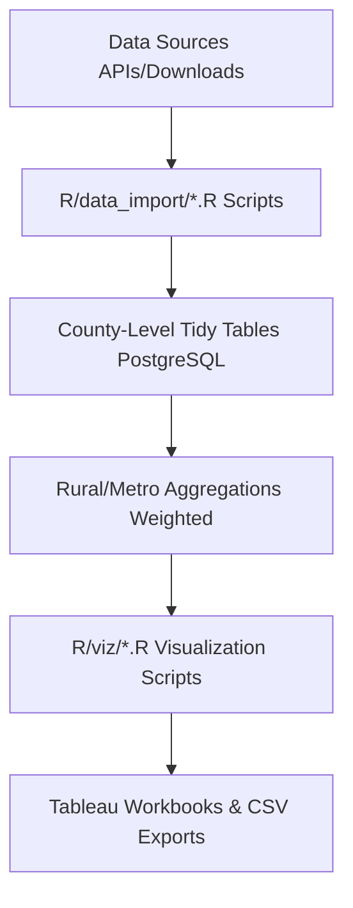

## Project Overview

The Rural Economic Outlook project is a comprehensive data infrastructure initiative that tracks rural economic conditions from 2007-2024. Built to support CORI's February 2026 Rural Economic Outlook webinar, this project integrates **12 federal datasets** covering 3,100+ U.S. counties to answer the critical question: **"What's changing, what's stuck, and what's emerging in rural America?"**

::: {.callout-important}
## Project Scope

The project establishes **2007 as a baseline year** (pre-Great Recession) to measure economic momentum across nearly two decades, enabling analysis of how rural economies have evolved through:

- Great Recession (2008-2009)
- Recovery period (2010-2019)
- Pandemic era (2020-2021)
- Post-pandemic period (2022-2024)
:::

::: {.callout-tip icon=false}
## Quick Links

- [GitHub Repository](https://github.com/ruralinnovation/data-rural-economic-outlook)
- Database Schema: `proj_rural_economic_outlook` (PostgreSQL)
- Configuration: `params.yml`
:::

## Key Questions

The project addresses **8 major analytical themes**:

::: {.panel-tabset}

### Macro Conditions

**How has rural GDP per capita grown compared to metro areas?**

Tracking real GDP growth using BEA data to understand rural economic momentum relative to metropolitan areas over the 2007-2023 period.

### Labor Markets

**Are rural areas facing labor shortages? What are employment and wage trends?**

Analyzing QCEW employment and wage data, ACS prime-age employment rates, and sectoral shifts in the rural labor market.

### Industry Structure

**How concentrated are rural economies? Which sectors are growing/declining?**

Using Herfindahl-Hirschman Index (HHI) to measure industry concentration and tracking sectoral composition changes over time.

### Business Dynamics

**Are rural areas creating new businesses? What role do young firms play in job creation?**

Examining business entry/exit rates, firm age distributions, and the share of jobs created by young firms (0-5 years old) using BDS and BFS data.

### Tech & Remote Work

**How has remote work changed rural labor markets? Where are tech jobs located?**

Tracking ACS occupation data to measure remote work adoption and technology sector employment in rural areas.

### Cost Pressures

**Housing affordability, migration patterns, local fiscal capacity**

Analyzing housing cost burden, building permits, migration flows, and their implications for rural community sustainability.

### Forward Outlook

**Scenario planning for 2026-2028**

Developing projections based on historical trends and current economic indicators.

### AI Opportunities

**Where can AI boost rural productivity?**

Identifying sectors and communities where AI adoption could enhance economic performance.

:::

## Methodology

::: {.callout-note}
## Data Integration Strategy

The project uses a **tidy data architecture** for reproducible analysis:
:::

### ETL Pipeline



:::: {.columns}

::: {.column width="48%"}
### Geographic Classification

All analysis uses **CBSA 2023** rural definition from the [ruraldefinitions package](/packages/ruraldefinitions/) to ensure consistent rural vs. metropolitan comparisons across all datasets.
:::

::: {.column width="4%"}
:::

::: {.column width="48%"}
### Temporal Coverage

- **Baseline:** 2007 (pre-Great Recession = 100 index)
- **Analysis Period:** 2007-2024 (18 years)
- **Milestone Years:** 2007, 2010, 2019, 2020-2021, 2023-2024
:::

::::

### Inflation Adjustment

::: {.callout-note}
## Price Adjustment Methods

All monetary values adjusted to **2023 dollars** using:

| Data Source | Method |
|-------------|--------|
| **BEA GDP** | Chain-weighted 2017 dollars (already inflation-adjusted) |
| **QCEW Wages** | Deflated using BLS CPI-U-RS (Consumer Price Index Research Series) |
| **IRS Migration AGI** | Deflated using CPI-U-RS |
:::

## Data Sources & Integration

### Demographics & Population (83 Variables Total)

| Dataset | Variables | Years | Key Metrics |
|---------|-----------|-------|-------------|
| [Census Population Estimates](/datasets/census-population-estimates/) | Population totals, age structure | 2007-2024 | Denominators for per-capita rates |
| [Census PEP Components](/datasets/census-pep-components/) | Births, deaths, migration | 2007-2023 | Natural increase vs. migration drivers |
| [American Community Survey](/datasets/american-community-survey/) | 88 variables: demographics, labor, housing, occupations | 2013, 2018, 2023 | Prime-age employment, remote work, cost burden, education |

### Economic Output & Labor Markets

| Dataset | Variables | Years | Key Metrics |
|---------|-----------|-------|-------------|
| [BEA Real GDP](/datasets/bea-real-gdp/) | Real GDP per capita | 2007-2023 | Economic growth momentum (2007=100) |
| [QCEW Employment & Wages](/datasets/qcew-employment-wages/) | Employment, wages by industry, HHI | 2007-2024 | Real wage growth, sectoral shifts, industry concentration |

### Business Dynamics & Entrepreneurship

| Dataset | Variables | Years | Key Metrics |
|---------|-----------|-------|-------------|
| [Business Dynamics Statistics](/datasets/census-bds/) | Entry/exit rates, job creation by firm age | 2007-2023 | Young firm job creation share, business dynamism |
| [Business Formation Statistics](/datasets/census-bfs/) | Business applications | 2007-2024 | Leading indicator of entrepreneurship |

### Migration & Housing Supply

| Dataset | Variables | Years | Key Metrics |
|---------|-----------|-------|-------------|
| [IRS Migration](/datasets/irs-migration/) | County-to-county flows, AGI flows | 2007-2022 | Net migration rates, income flows |
| [Building Permits](/datasets/census-building-permits/) | Housing units authorized | 2007-2024 | Housing supply per 1,000 population |

### Innovation & Classification

| Dataset | Variables | Years | Key Metrics |
|---------|-----------|-------|-------------|
| [USPTO Patents](/datasets/uspto-patents/) | Patent counts by assignee location | 2014-2024 | Innovation indicator |
| [USDA County Typology](/datasets/usda-county-typology/) | Economic specialization, persistent poverty | 2025 edition | Stratification for analysis |
| [FCC Broadband](/datasets/fcc-broadband/) | Broadband availability by technology | 2025 | Digital infrastructure |

## Key Findings

::: {.panel-tabset}

### Economic Growth

::: {.callout-important}
## GDP & Wage Trends (2007-2024)

- **Rural GDP growth lags metro** - Rural real GDP per capita grew XX% vs. metro XX%
- **Wage gap persists** - Real wages in rural areas remain XX% below metro, despite similar growth rates
- **Industry concentration** - Rural economies more concentrated (higher HHI) than metro

*Note: Specific statistics to be updated with final analysis results*
:::

### Labor Markets

::: {.callout-important}
## Employment Dynamics

- **Prime-age employment** - Rural prime-age (25-54) employment rate: XX% (2023)
- **Remote work surge** - Rural remote work rate increased from X% (2013) to XX% (2023)
- **Sectoral shifts** - Manufacturing share declined, professional services grew
:::

### Business Formation

::: {.callout-important}
## Entrepreneurship Trends

- **Startup rates lower** - Rural business entry rates XX% vs. metro XX%
- **Young firm job creation** - Rural: XX% of jobs from 0-5 year firms vs. metro: XX%
- **Pandemic surge** - Business applications spiked 2020-2021, but conversion rates uncertain
:::

### Migration

::: {.callout-important}
## Population Movement

- **Natural decrease accelerating** - ~50% of rural counties have deaths > births
- **Pandemic reversal** - 2020-2021 saw positive rural net migration for first time in decades
- **Income flows matter** - Some rural counties gain people but lose income (AGI)
:::

### Housing & Costs

::: {.callout-important}
## Cost Pressures

- **Housing supply constraints** - Rural permits per 1,000 population: X vs. metro: XX
- **Cost burden rising** - Renter cost burden increased from XX% to XX%
- **Aging housing stock** - Limited new construction in many rural areas
:::

:::

## Technical Implementation

### Data Quality Controls

::: {.callout-note}
## Quality Assurance Process

- **Variable count assertions** - Verify all expected variables present (e.g., ACS: 88 variables)
- **Geographic coverage checks** - All 3,100+ counties accounted for
- **Temporal consistency** - Label changes documented (e.g., ACS "at home" → "from home")
- **Deflation verification** - CPI-U-RS applied consistently across wage variables
- **Missing value handling** - Explicit NA treatment for cost burden, occupation shares
:::

### Reproducibility

All code and documentation available:

:::: {.columns}

::: {.column width="48%"}
**Code & Scripts**

- R scripts - Modular ETL for each data source
- Parameters file - `params.yml` centralizes configuration
:::

::: {.column width="4%"}
:::

::: {.column width="48%"}
**Documentation**

- Data codebook - 83 variables documented with sources, units, notes
- Import documentation - Detailed profiles for each data source
:::

::::

## Outputs

::: {.panel-tabset}

### Data Products

- **County-level tidy tables** - One row per county per year per variable
- **Rural/metro aggregations** - Weighted averages and sums by rural classification
- **Chart-ready datasets** - 27 visualization datasets for webinar
- **Excel export** - `Rural Innovation.xlsx` for stakeholder sharing

### Visualizations

- GDP growth indices (2007=100 baseline)
- Real wage trends by sector
- Employment composition changes
- Business formation rates
- Migration flow maps
- Housing supply indicators
- Industry concentration (HHI) distributions

### Documentation

- **DATA_CODEBOOK.csv** - Complete variable dictionary
- **README.md** - Data source inventory and ETL priorities
- **BFS_DATA_SOURCE_PROFILE.md** - Detailed source profile template
- **chart_data_readiness.csv** - Mapping of visualizations to data requirements

:::

## Challenges & Solutions

::: {.panel-tabset}

### BEA Employment Tables

**Challenge:** BEA county employment tables (CAEMP25N, CAINC6N) ended after 2022.

**Solution:** Switched to [QCEW data](/datasets/qcew-employment-wages/) for 2023-2024 employment, providing comparable industry detail with quarterly updates.

### ACS Variable Labels

**Challenge:** ACS variable labels changed formatting ("!!" → "::"; "at home" → "from home").

**Solution:** Documented all changes in `acs_variable_problems.csv`; verified underlying variable codes (B-series) remain consistent; data is comparable despite cosmetic label changes.

### BFS Data Limitations

**Challenge:** High-propensity business applications (HBA) not available at county level; only ~11-12% of business applications (BA) become employer firms.

**Solution:** Use BA as intent indicator; link to [BDS](/datasets/census-bds/) (18-month lag) for actual employer firm formation.

### IRS Migration Lag

**Challenge:** IRS migration data released 18-24 months after tax year.

**Solution:** Use [Census Components of Change](/datasets/census-pep-components/) for timely total migration; use IRS for detailed flow and income analysis.

:::

## Impact & Applications

::: {.panel-tabset}

### Policy Applications

- **Federal funding formulas** - Data used in USDA, EDA, and ARC program targeting
- **Economic development strategy** - Identify growth sectors and entrepreneurship gaps
- **Broadband investment** - Combine with [FCC data](/datasets/fcc-broadband/) for infrastructure targeting
- **Workforce development** - Occupation and education data inform training programs

### Research Applications

- Rural economic resilience
- Effects of remote work on rural labor markets
- Entrepreneurship ecosystem assessment
- Migration and demographic change
- Regional inequality trends

### Webinar Series

Data infrastructure supports CORI's quarterly economic outlook webinars:

- **February 2026:** "Rural America in 2026: What's Changing, What's Stuck, What's Emerging"
- **Future editions:** Ongoing monitoring of rural economic conditions

:::

## Project Team

::: {.callout-note icon=false}
## CORI Mapping and Data Analytics Team

- Data infrastructure architecture
- ETL pipeline development
- Analysis and visualization
- Documentation and methodology
:::

## Resources & Links

::: {.panel-tabset}

### Data & Code

- **GitHub Repository:** [data-rural-economic-outlook](https://github.com/ruralinnovation/data-rural-economic-outlook)
- **Database Schema:** `proj_rural_economic_outlook` (PostgreSQL)
- **Configuration:** `params.yml` (API keys, year ranges, URLs)

### R Packages

| Package | Purpose | Documentation |
|---------|---------|---------------|
| [cori.data.bds](/packages/cori-data-bds/) | Business Dynamics Statistics | [View docs](/packages/cori-data-bds/) |
| [cori.data.fcc](/packages/cori-data-fcc/) | FCC Broadband Map | [View docs](/packages/cori-data-fcc/) |
| [ruraldefinitions](/packages/ruraldefinitions/) | Rural classification | [View docs](/packages/ruraldefinitions/) |
| tidybea | BEA API access | External |
| tidycensus | Census API access | External |
| blsAPI | BLS API access | External |

### Datasets

**Demographics & Population:**

- [Census Population Estimates](/datasets/census-population-estimates/)
- [Census PEP Components of Change](/datasets/census-pep-components/)
- [American Community Survey](/datasets/american-community-survey/)

**Economic Indicators:**

- [BEA Real GDP Per Capita](/datasets/bea-real-gdp/)
- [QCEW Employment & Wages](/datasets/qcew-employment-wages/)

**Business & Entrepreneurship:**

- [Business Dynamics Statistics](/datasets/census-bds/)
- [Business Formation Statistics](/datasets/census-bfs/)
- [Building Permits Survey](/datasets/census-building-permits/)

**Migration & Innovation:**

- [IRS County-to-County Migration](/datasets/irs-migration/)
- [USPTO Patents](/datasets/uspto-patents/)

**Classification & Infrastructure:**

- [USDA ERS County Typology](/datasets/usda-county-typology/)
- [FCC National Broadband Map](/datasets/fcc-broadband/)

:::

## Future Directions

::: {.panel-tabset}

### Data Enhancements

- Add Zillow housing price data (median home values, rent indices)
- Incorporate BLS LAUS unemployment rates (monthly frequency)
- Add Lightcast industry forecasts (forward-looking)
- Integrate AI exposure indices (automation risk)

### Analytical Extensions

- County-level cluster analysis (identify economic types beyond USDA typology)
- Causal inference models (e.g., broadband impact on employment)
- Scenario modeling (2026-2028 projections)
- Industry-specific deep dives (manufacturing, recreation, tech)

### Infrastructure Improvements

- Automated ETL pipeline (scheduled monthly updates)
- API endpoint for external access to tidy tables
- Interactive dashboard (Shiny or Tableau Public)
- Real-time data quality monitoring

:::

## Citation

If using this data infrastructure or analysis in your work, please cite:

```
Center on Rural Innovation. (2026). Rural Economic Outlook Data Infrastructure.
Retrieved from https://github.com/ruralinnovation/data-rural-economic-outlook
```

## Contact

For questions about this project, contact the CORI Mapping and Data Analytics Team at [data@ruralinnovation.us](mailto:data@ruralinnovation.us).

---

**Last Updated:** February 2, 2026
**Project Status:** Active
**Data Coverage:** 2007-2024
